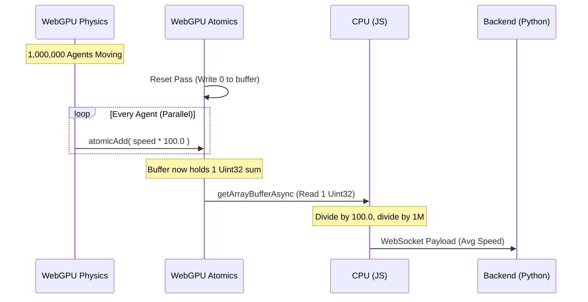

# abm.gl GOALS & ROADMAP

The "Unreal Engine" for complex adaptive systems and Agent-Based Modeling. `abm.gl` is a Hybrid Macro/Micro architecture designed to bypass the traditional Python/JVM bottlenecks by moving massive-scale physics to WebGPU, while retaining Python for cognitive LLM-based agents.

## Key Features
- **Micro Engine (Brawn)**: 1,000,000+ deterministic agents running simultaneously at 60fps via Three.js (TSL) Compute Shaders.
- **Macro Engine (Brain)**: Institutional LLM-powered agents (via Shachi) that analyze aggregate data and dispatch global policy.
- **Lockstep Time**: Scientific reproducibility by pausing the physical GPU simulation during LLM inference.

## Tech Stack
- **Backend**: Python 3.12+, FastAPI, Shachi (litellm), Pydantic
- **Frontend**: Next.js 15, React Three Fiber, Three.js (WebGPU/TSL)
- **Bridge**: WebSockets

---

## Prerequisites
- Node.js 20+
- Python 3.12+ (or `uv`)
- An OpenAI or Anthropic API Key (for future LLM inference)

---

## Getting Started

### 1. The Macro Engine (Backend)

The backend handles all WebSocket broadcasting and LLM inference.

```bash
cd backend
python -m venv venv

# On Windows
.\venv\Scripts\activate
# On Mac/Linux
source venv/bin/activate

pip install fastapi uvicorn websockets pydantic litellm python-dotenv
uvicorn server:app --reload
```

### 2. The Micro Engine (Frontend)

The frontend handles all WebGPU rendering and compute physics.

```bash
cd frontend
npm install
npm run dev
```
Open [http://localhost:3000](http://localhost:3000).

---

## Phase 2: Lockstep Time & LiteLLM Bridge (Complete)
Phase 2 successfully replaced mock loops with actual WebGPU compute physics and real LLM inference. 
- **WebGPURenderer Injection** enabled TSL natively in React Three Fiber.
- **LiteLLM Structured Outputs** enforced the strict Pydantic JSON schema at the LLM level.
- CPU/JS readback aggregated 10,000 instances instantaneously.

---

## Architecture (Code Explanation)

### Phase 3: WebGPU Atomic Aggregation (Complete)
As we scale the simulation to **1,000,000 agents**, pulling 1 million floats (velocities) from VRAM to system RAM every 5 seconds creates a catastrophic bottleneck. 

Phase 3 introduces **WebGPU Atomic Aggregation** to execute the statistical reduction natively on the GPU compute pipeline. Instead of passing 1,000,000 numbers to the CPU, we pass exactly **1 integer**.



**How it works in code:**
To circumvent WebGPU's lack of support for float atomics, we utilize a fixed-point math workaround. In the `aggregateStats` TSL compute node, we multiply the float speed by `100.0` to preserve 2 decimal places, cast it to a `uint`, and use `atomicAdd()` on a single 1-element `StorageInstancedBufferAttribute`. The multiplier of 100 (instead of 1000) prevents a 32-bit integer overflow (max ~4.29 billion) for high-speed agents, providing safe mathematical headroom. The JS CPU then effortlessly reads back the single `Uint32` to finalize the math.

---

## Phase 4: Next.js Command Center (ChartGPU) (Complete)
Phase 4 introduced a modern, high-performance UI overlay for real-time telemetry streaming and lockstep control.
- **Glassmorphism HUD**: A sleek Next.js `DashboardOverlay` built with Tailwind CSS.
- **ChartGPU Integration**: A native WebGPU charting engine that plots real-time agent speed vs LLM policy speed at 60fps, entirely bypassing React state for maximum performance.
- **Lockstep Controls**: A Pause/Resume button that halts the WebGPU compute physics simulation independently of the React lifecycle.

---

## Phase 5: WebGPU Spatial Awareness (Complete)
To provide the LLM with actual geospatial context (rather than a blind global average), Phase 5 upgraded the architecture to support spatial patches:
- **Spatial Grid**: The 1-element WebGPU aggregate buffer was expanded into a 10x10 spatial grid (100 sectors).
- **Atomic Grouping**: As agents drift through the continuous 50x50 world, the Compute Shader maps their coordinates to discrete grid cells, utilizing `atomicAdd` to accumulate speed and agent density per sector without breaking parallel performance.
- **LLM Geospatial Context**: The Python backend deserializes this 2D matrix, identifying local hotspots and anomalous density, allowing Shachi to issue targeted policy interventions instead of just global rules.

---

## Architecture Hardening: Production Polish (Complete)
Following the Phase 5 prototype, the simulation underwent a massive architectural overhaul to support production-level scaling and $O(N^2)$ collision logic:
- **Lockstep Physics**: Disconnected the WebGPU physics loop from the LLM inference latency. However, for scientific reproducibility, the physics simulation is intentionally paused (lockstep) while the Shachi backend thinks asynchronously, ensuring deterministic state progression.
- **Multi-Tenant Backend**: The FastAPI backend was refactored from a global singleton into a session-scoped WebSocket architecture, allowing multiple users to connect and run independent physical swarms simultaneously.
- **Integer Overflow Protection**: The TSL precision multiplier was dropped to mathematically eliminate the risk of a 32-bit uint overflow during extreme agent clustering.
- **100x100 Physics Grid**: The LLM Telemetry Grid (10x10) was decoupled from the WebGPU Collision Grid (100x100). By expanding to 10,000 cells, the $O(N^2)$ collision loop is kept extremely tight, completely eliminating the GPU Timeout Detection and Recovery (TDR) crash risk at the 1,000,000 scale.
- **GPU Spatial Hash Grid**: Replaced $O(N^2)$ collision math with a 4-Pass Radix Sort directly in Three.js TSL. A single-thread Compute Shader calculates a Prefix Sum, allowing 1,000,000 agents to map into a dense sorted array and calculate localized separation forces natively on the GPU.
- **Spatial Heterogeneity (Field Maps)**: Replaced the global scalar `policy_speed` with a 10x10 float array. The frontend uses a Three.js `DataTexture` with Bilinear Interpolation, enabling smooth, seamless gradients between high-speed highways and low-speed quarantine zones based on LLM output.

---

## Security Upgrades (Complete)
- **Denial of Wallet Protection (WebSocket Auth)**: Implemented a shared token handshake across the WebSocket layer to secure the FastAPI backend from unauthenticated API consumption, keeping the LLM endpoints safe while maintaining a seamless local developer experience.

---

## GPU Performance Upgrades (Complete)
- **Parallel Blelloch Scan**: Replaced the $O(N)$ single-threaded prefix sum with a 3-pass Chunked Parallel Blelloch Scan in TSL. Utilizes `workgroupArray` shared memory and `workgroupBarrier()` to achieve work-efficient $O(N)$ compute with $O(\log N)$ step depth, completely unblocking the 1,000,000 agent scale.
- **Atomic Contention Mitigation**: Solved the L2 cache atomic bottleneck when agents flock densely. Implemented a Workgroup-Local Bitonic Sort and Run-Length Batching strategy using `workgroupArray`. By locally sorting agents in shared memory, we successfully batched contiguous runs and reduced 256 global atomic operations down to a single global atomic per workgroup.
- **Dynamic Collision Loop Sizing**: Replaced the statically hardcoded 64-iteration neighbor loop with dynamic search radius loop bounds and the native TSL `Loop` primitive. This instantly speeds up sparse cells while enforcing a hard 1024-neighbor cap to strictly preserve GPU TDR safety during dense singularities.
- **Robust PRNG (PCG Hash)**: Replaced flawed sine-wave based pseudo-randomness with a GPU-optimized PCG Hash function. This successfully solved strange macroscopic grid artifacts (vertical/horizontal flocking alignment) and eliminated float32 precision loss across 1,000,000+ parallel threads.

---

## Phase 6: Multivariate Density Heatmap UI (Complete)
Phase 6 visualizes the "dark data" generated by the spatial grid by rendering a real-time 10x10 heatmap overlay on the Next.js Dashboard. By mapping the grid directly to raw DOM nodes, the heatmap updates at 10Hz with zero React re-renders, preventing garbage collection spikes. 
- **Multivariate Blending**: Rather than simple red density, the heatmap dynamically interpolates exact RGB values based on the cell's underlying demographic state (Green = Susceptible, Red = Infected, Blue = Recovered). As epidemics sweep through neighborhoods, the visual quadrant dynamically shifts through gradients of Orange, Purple, and Teal.

---

## Phase 7: SIR Epidemic Model (Complete)
Phase 7 transforms the particle system into a true Agent-Based Model by implementing a classic "Susceptible-Infected-Recovered" (SIR) epidemic spread.
- **Infection State Vector**: A discrete `Uint32Array` tracks the health of all 1,000,000 agents. Patient Zeros are dynamically seeded during the Setup phase.
- **Thread-Local Transmission**: During the WebGPU $O(N^2)$ spatial collision pass, Healthy threads that detect proximity to an Infected neighbor check against a global `transmission_probability` scalar to determine if they become infected.
- **Timer Nodes (Recovery)**: A dedicated `Float32Array` tracks physical time elapsed since infection, managed entirely in the Compute Shader. Upon hitting the `recovery_time` threshold, agents transition to State 2 (Immune) and no longer transmit the virus.
- **Visual Feedback**: The React Three Fiber `pointsMaterial` utilizes TSL `select` nodes to instantaneously render states: Susceptible (Green), Infected (Red), and Recovered (Blue).
- **Macro-Level Lockdowns**: The GPU aggregates spatial infection and recovery counts, streaming them to the Python backend. The LLM Mayor detects outbreak hotspots and enforces localized quarantines by dropping the target speed to `0.0`.

---

## Phase 8: Adaptive NetLogo UI & Ground Zero (Complete)
Phase 8 transforms the hardcoded Next.js overlay into a generalized, dynamic Agent-Based Modeling platform mimicking the classic NetLogo UI.
- **JSON Declarative UI**: A central `modelSchema.json` completely dictates the left-hand sidebar, mapping configuration (sliders, buttons, text fields) directly to a dynamic React renderer.
- **Zustand-to-WebGPU Pipeline**: TSL `uniform` nodes are bound directly to Zustand store state, allowing React UI sliders to interactively manipulate the 1,000,000-agent GPU compute physics with zero performance overhead.
- **Setup & Ground Zero**: The classic ABM "Setup" button is wired to a dedicated WebGPU compute pass that resets positions and intelligently seeds a centralized "Ground Zero" viral cluster, allowing researchers to watch the macro spread dynamically.
- **Dynamic WebGPU Allocation**: The Agent Count is fully decoupled from static constants. Modifying the `agent_count` text field gracefully unmounts the simulation and dynamically re-allocates all `StorageInstancedBufferAttribute` memory arrays instantly, allowing safe scaling from 1 to 1,000,000 agents directly from the UI.

---

## Phase 9: Multi-Agent Policy Network (Complete)
Phase 9 expanded the Python backend from a single `Shachi` Mayor into a distributed multi-agent network architecture (Advisors vs. Governors). Instead of one LLM making all decisions, we implemented a concurrent multi-agent graph:

- **Level 1 (The Advisors)**: Independent LLMs running concurrently (`asyncio.gather`).
  - **Public Health Advisor**: Analyzes the grid to find maximum density hotspots and recommends targeted quarantine zones (low speeds) to prevent virus spread.
  - **Chief Economist Advisor**: Analyzes the grid to maintain high throughput and flow, recommending high-speed highways to maximize economic activity.
- **Level 2 (The Governor/Synthesizer)**:
  - **The Mayor (Governor)**: Receives the raw 10x10 grid stats AND the written reports/proposals from both the Health Advisor and the Economist Advisor. The Mayor synthesizes these competing priorities into the final 10x10 `policy_speed_map`.

This introduces complex social dynamics and competing priorities into the physical simulation, elevating it from a fluid particle system into a true Complex Adaptive System.

---

## Phase 10: Performance Tuning & React StrictMode Resiliency (Complete)
Phase 10 focuses on resolving scaling limits and lifecycle bugs when pushing the simulation to its absolute breaking point (500k-1M agents).
- **Uniform Strided Sampling**: In the WebGPU compute nodes, replaced unbounded $O(N)$ density checks with an $O(8)$ uniform stride. This guarantees the GPU ALUs never exceed exactly 72 neighbor collision checks per agent per frame, restoring 60+ FPS at 100,000 agents even during massive singularity collapses.
- **React StrictMode Resiliency**: Hardened the WebGPU `ChartGPU` engine against React 18's double-mount lifecycle by explicitly tying `.dispose()` to the `useEffect` unmount phase, entirely preventing zombie DOM canvas elements and WebGL context memory leaks.
- **Asynchronous Telemetry Dispatch**: Disconnected the `ChartGPU` high-frequency metric rendering from the React DOM tree entirely. Telemetry is natively streamed at 60Hz via DOM CustomEvents (`abm-telemetry`) and injected straight into the WebGL texture using `appendData()`, dropping main-thread CPU overhead to near-zero.
- **Lazy Telemetry Aggregation**: Decoupled the global `atomicAdd` calls from the 60FPS physics loop. By moving the spatial density accumulation into a standalone `telemetryAggregateNode` and only executing it synchronously before a JavaScript readback (e.g., 2-10Hz), we eliminated massive memory contention where 2,000,000 parallel threads were attempting to write to 400 shared grid indices every frame. This successfully unblocked the hardware ALUs and stabilized the frame rate for 500,000+ agents.
