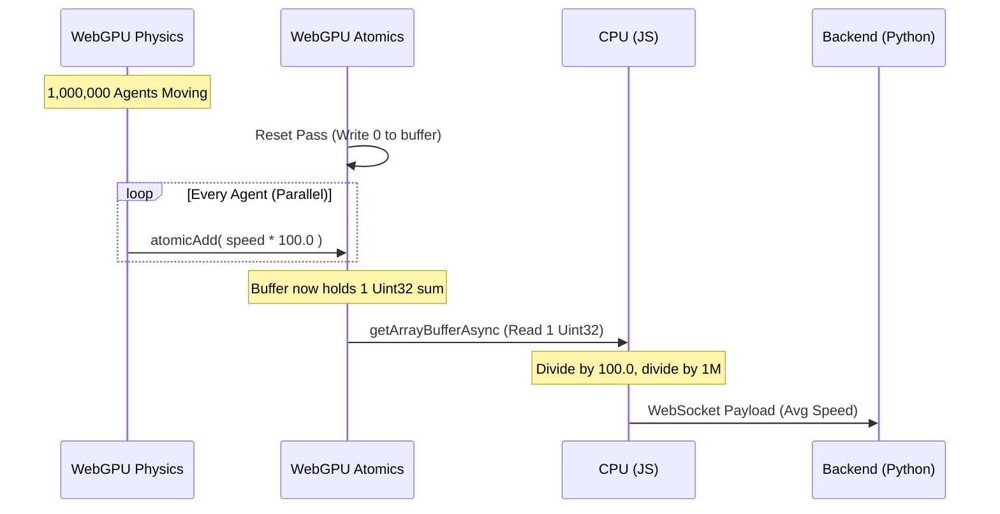

# abm.gl

The "Unreal Engine" for complex adaptive systems and Agent-Based Modeling. `abm.gl` is a Hybrid Macro/Micro architecture designed to bypass the traditional Python/JVM bottlenecks by moving massive-scale physics to WebGPU, while retaining Python for cognitive LLM-based agents.

## Key Features
- **Micro Engine (Brawn)**: 1,000,000+ deterministic agents running simultaneously at 60fps via Three.js (TSL) Compute Shaders.
- **Macro Engine (Brain)**: Institutional LLM-powered agents (via Shachi) that analyze aggregate data and dispatch global policy.
- **Lockstep Time**: Scientific reproducibility by pausing the physical GPU simulation during LLM inference.

## Tech Stack
- **Backend**: Python 3.12+, FastAPI, Shachi (litellm), Pydantic
- **Frontend**: Next.js 15, React Three Fiber, Three.js (WebGPU/TSL)
- **Bridge**: WebSockets

---

## Prerequisites
- Node.js 20+
- Python 3.12+ (or `uv`)
- An OpenAI or Anthropic API Key (for future LLM inference)

---

## Getting Started

### 1. The Macro Engine (Backend)

The backend handles all WebSocket broadcasting and LLM inference.

```bash
cd backend
python -m venv venv

# On Windows
.\venv\Scripts\activate
# On Mac/Linux
source venv/bin/activate

pip install fastapi uvicorn websockets pydantic litellm python-dotenv
uvicorn server:app --reload
```

### 2. The Micro Engine (Frontend)

The frontend handles all WebGPU rendering and compute physics.

```bash
cd frontend
npm install
npm run dev
```
Open [http://localhost:3000](http://localhost:3000).

---

## Phase 2: Lockstep Time & LiteLLM Bridge (Complete)
Phase 2 successfully replaced mock loops with actual WebGPU compute physics and real LLM inference. 
- **WebGPURenderer Injection** enabled TSL natively in React Three Fiber.
- **LiteLLM Structured Outputs** enforced the strict Pydantic JSON schema at the LLM level.
- CPU/JS readback aggregated 10,000 instances instantaneously.

---

## Architecture (Code Explanation)

### Phase 3: WebGPU Atomic Aggregation (In Planning)
As we scale the simulation to **1,000,000 agents**, pulling 1 million floats (velocities) from VRAM to system RAM every 5 seconds creates a catastrophic bottleneck. 

Phase 3 introduces **WebGPU Atomic Aggregation** to execute the statistical reduction natively on the GPU compute pipeline. Instead of passing 1,000,000 numbers to the CPU, we pass exactly **1 integer**.



**How it works in code:**
To circumvent WebGPU's lack of support for float atomics, we utilize a fixed-point math workaround. In the `aggregateStats` TSL compute node, we multiply the float speed by `100.0` to preserve 2 decimal places, cast it to a `uint`, and use `atomicAdd()` on a single 1-element `StorageInstancedBufferAttribute`. The multiplier of 100 (instead of 1000) prevents a 32-bit integer overflow (max ~4.29 billion) for high-speed agents, providing safe mathematical headroom. The JS CPU then effortlessly reads back the single `Uint32` to finalize the math.
