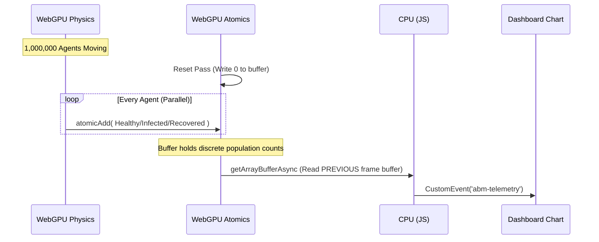

# abm.gl: The "Unreal Engine" for Agent-Based Modeling

`abm.gl` is a massive-scale, high-performance Agent-Based Modeling (ABM) framework built natively for the web. By leveraging the power of WebGPU Compute Shaders via Three.js (TSL), `abm.gl` shatters traditional CPU limits—simulating and rendering **1,000,000+ autonomous agents at high FPS** entirely within a standard web browser.

## The WebGPU Leap: Why Build This?

Historically, massive-scale agent-based modeling required heavy C++/CUDA frameworks like FLAME GPU 2, locking researchers into specific proprietary hardware (NVIDIA GPUs) and demanding complex environment setups. 

`abm.gl` represents a **democratization leap forward** for scientific computing:
- **Zero-Friction Deployment:** No C++ compilers, no CUDA toolkits, no Python backend required. Just click a URL and enter the simulation.
- **Device Agnostic:** Runs on Apple Silicon (M-series Macs), AMD, NVIDIA, and mobile devices natively. WebGPU translates seamlessly to Metal, DirectX 12, and Vulkan under the hood.
- **Modern Ecosystem:** Seamlessly integrates with React, Next.js, and modern web visualization libraries (ChartGPU) for beautiful, declarative command center UI overlays.

---

## Quick Start

You can run the entire 1,000,000+ agent simulation locally without a single backend dependency.

```bash
git clone https://github.com/kai-erlenbusch/abm.gl
cd abm.gl/frontend

npm install
npm run dev
```

Open [http://localhost:3000](http://localhost:3000) and click the **SETUP** button. 

---

## Architectural Breakdown (Under the Hood)

### 1. The Death of $O(N^2)$ (Spatial Hashing)
The core challenge in ABMs is collision detection. If 1,000,000 agents check every other agent, that's 1 trillion checks per frame. `abm.gl` bypasses this by utilizing a **4-Pass Radix Sort directly in the GPU**. 
1. The 50x50 world is divided into a 100x100 grid (10,000 cells).
2. A TSL Compute Shader calculates a **Prefix Sum (Blelloch Scan)** to sort agents into memory buffers based on their spatial grid index.
3. Agents only query neighbors within their immediate adjacent memory blocks, capping checks at a strict hardware-safe threshold (Volume Exclusion).

### 2. Eliminating Warp Divergence
On a GPU, threads execute in "warps" (groups of 32). If threads in a warp loop over wildly different spatial densities, they diverge, causing massive performance loss.
`abm.gl` solves this by assigning GPU threads based on the agents' *spatially sorted memory index*. Because the 32 threads in a warp are physically adjacent in the simulation, they experience identical local density, eliminating warp divergence and preventing GPU crashes during "dense singularity" clustering events.

### 3. The Epidemic Engine (SIR Model)
To prove the framework's capability, `abm.gl` implements a full "Susceptible-Infected-Recovered" (SIR) epidemiological model entirely inside the GPU Compute pipeline.
- **Thread-Local Transmission**: Healthy agents detect Infected neighbors via the spatial hash and roll against a `transmission_probability` scalar.
- **Dedicated GPU Timers**: A `Float32Array` buffer tracks the elapsed time of infection. Agents transition to Immune natively when the threshold is hit.
- **Instant Visual State**: React Three Fiber reads the state buffer via TSL `select` nodes to instantaneously render agents as Green (Susceptible), Red (Infected), or Blue (Recovered).

### 4. Telemetry via GPU Atomic Aggregation
Streaming the exact state of 1,000,000 agents to the CPU every frame would cripple the main thread. Instead, `abm.gl` executes statistical reduction directly on the GPU.

#### The L2 Cache Global Atomic Revelation
During extreme load testing (500,000+ agents), we attempted to implement a complex L1 Cache shared-memory architecture using WebGPU `workgroupArray` and `workgroupBarrier`. However, hardware profiling revealed a fascinating quirk of modern GPUs: because our telemetry density grid is incredibly small (400 bins / ~1.6 KB), it perfectly fits inside the GPU's ultra-fast global L2 Cache. Forcing the GPU into explicit workgroup synchronizations actually *choked* performance down to 11 FPS. By reverting to absolute brute-force global atomics (`atomicAdd`), modern GPU silicon routing takes over, instantly processing 1M agents at high framerates.

#### Telemetry Double Buffering (Ping-Pong Readback)
Even with fast GPU telemetry, reading data out of WebGPU (`getArrayBufferAsync`) stalled the main render loop if the GPU was still calculating the frame telemetry, causing massive UI stuttering and "janky" controls. `abm.gl` solves this by maintaining two independent telemetry buffers. On even frames, the GPU computes into Buffer A, and the CPU reads back Buffer B (from the previous frame). On odd frames, they swap. This means the CPU maps data the GPU finished writing 16ms ago, entirely eliminating the synchronization stall!



### 5. Next.js Command Center
The React frontend completely wraps the simulation in an interactive HUD.
- **Declarative Sliders**: Zustand variables inject directly into WebGPU `uniform` nodes, allowing researchers to tweak Infection Radius or Transmission Probability live at 60 FPS without re-allocating buffers.
- **Zero-Render Heatmaps**: The 10x10 Spatial Density Grid relies on raw DOM mutation via `ref` attachments, avoiding React GC spikes and re-render lag while providing a 10Hz heatmap of the viral spread.
- **ChartGPU**: Native WebGL line charts track the live total counts of the SIR populations seamlessly.

### 6. Scientific Observability & Camera Controls
The `abm.gl` viewport uses `@react-three/drei`'s `MapControls` to provide a truly explorable simulation environment.
- **Limitless Pan & Zoom**: Users can expand the simulation world boundary dynamically, and use mouse/trackpad controls to dive into dense clusters or pull back for macro-scale views.
- **Abstracted Spatial Architecture**: The engine completely abstracts GPU optimization constraints from the user interface. The `Spatial Hash Cell Size` is dynamically computed on the fly based on the model's `max_interaction_radius` (e.g., the Infection Radius), ensuring the Prefix Sum radix sorting algorithm always runs with perfectly allocated memory chunks regardless of how the user tunes the physics parameters.

---

## Project Structure
- `frontend/src/app/page.tsx`: The primary execution loop and React overlay entry point.
- `frontend/src/components/TslPrimitives.ts`: The raw WebGPU compute shaders (flocking behavior, epidemic spread, atomic aggregations) built using Three.js node primitives.
- `frontend/src/engine/SpatialGrid.ts`: The complex parallel prefix-sum arrays and radix sorting algorithms responsible for spatial acceleration.
- `frontend/src/components/DashboardOverlay.tsx`: The UI command center handling the WebGL telemetry charts.

---

*This project was an exploratory exercise to push the limits of WebGPU in the browser. It proves that the web is officially ready for high-fidelity scientific computing without the friction of legacy infrastructure.*
