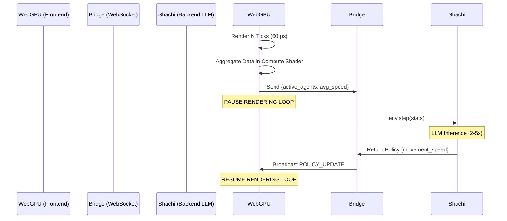

# abm.gl

The "Unreal Engine" for complex adaptive systems and Agent-Based Modeling. `abm.gl` is a Hybrid Macro/Micro architecture designed to bypass the traditional Python/JVM bottlenecks by moving massive-scale physics to WebGPU, while retaining Python for cognitive LLM-based agents.

## Key Features
- **Micro Engine (Brawn)**: 10,000+ deterministic agents running simultaneously at 60fps via Three.js (TSL) Compute Shaders.
- **Macro Engine (Brain)**: Institutional LLM-powered agents (via Shachi) that analyze aggregate data and dispatch global policy.
- **Lockstep Time**: Scientific reproducibility by pausing the physical GPU simulation during LLM inference.

## Tech Stack
- **Backend**: Python 3.12+, FastAPI, Shachi (litellm), Pydantic
- **Frontend**: Next.js 15, React Three Fiber, Three.js (WebGPU/TSL)
- **Bridge**: WebSockets

---

## Prerequisites
- Node.js 20+
- Python 3.12+ (or `uv`)
- An OpenAI or Anthropic API Key (for future LLM inference)

---

## Getting Started

### 1. The Macro Engine (Backend)

The backend handles all WebSocket broadcasting and LLM inference.

```bash
cd backend
python -m venv venv

# On Windows
.\venv\Scripts\activate
# On Mac/Linux
source venv/bin/activate

pip install fastapi uvicorn websockets pydantic litellm
uvicorn server:app --reload
```

### 2. The Micro Engine (Frontend)

The frontend handles all WebGPU rendering and compute physics.

```bash
cd frontend
npm install
npm run dev
```
Open [http://localhost:3000](http://localhost:3000).

---

## Architecture (Code Explanation)

### The Hybrid Loop
`abm.gl` solves the "Temporal Desync" between fast GPU rendering and slow LLM generation via **Lockstep Time**.



**How it works in code:**
The `frontend/src/components/SimulationCanvas.tsx` maintains a `useFrame` loop. It counts time, and when it's time to trigger the Macro Engine, it sets `isMacroThinking` to `true` and yields execution (halting the physical movement of the `InstancedMesh`). The `backend/server.py` awaits the WebSocket payload, calls `macro_agent.py` to validate the state via Pydantic, executes the LLM reasoning, and pushes a new JSON rule back to the browser.

---

## Phase 2 Development Plan

**Approach**: We have proven the WebSocket bridge and Lockstep Time. To finalize the Proof of Concept, we will replace the static rotational simulation with true independent agent physics via TSL, and replace the mocked LLM sleep with a live `litellm` call.

### Scope
- **In**: TSL Compute Shader for independent agent velocity/position, `litellm` integration with OpenAI/Anthropic for the Mayor agent.
- **Out**: Multi-agent debates, UI dashboards, complex bounding box physics.

### Action Items
- [ ] Refactor `TslPrimitives.ts` to implement a WebGPU ComputeNode that calculates random-walk vectors per instance.
- [ ] Update `SimulationCanvas.tsx` to bind the TSL ComputeNode to the `InstancedMesh`.
- [ ] Add `.env` file support to `backend/` for `OPENAI_API_KEY`.
- [ ] Refactor `macro_agent.py` to use `litellm.acompletion` to generate a real JSON policy based on aggregate stats.
- [ ] **Validation**: Verify that agents physically move independently on the canvas and dynamically change trajectory based on the actual LLM output string logged in the terminal.

### Architectural Decisions
- **GPU Aggregation Deferred**: For Phase 2 (10,000 agents), calculating aggregate data (e.g. average speed) is performed via CPU/JS reduction. Pulling the buffer back to JS is practically instantaneous for 10k agents. Complex WebGPU parallel reduction compute shaders are deferred to Phase 3 (1,000,000 agents).
